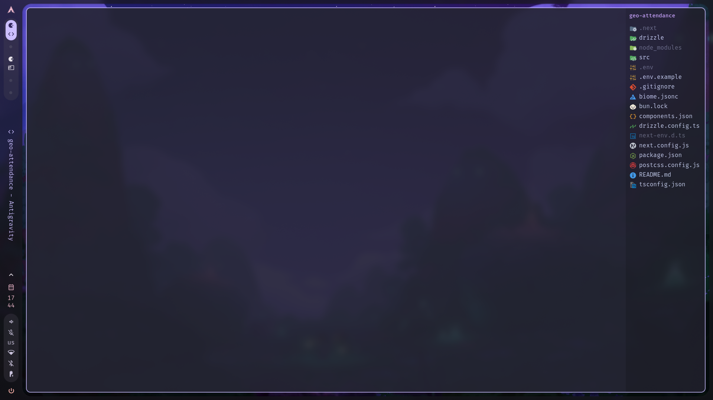
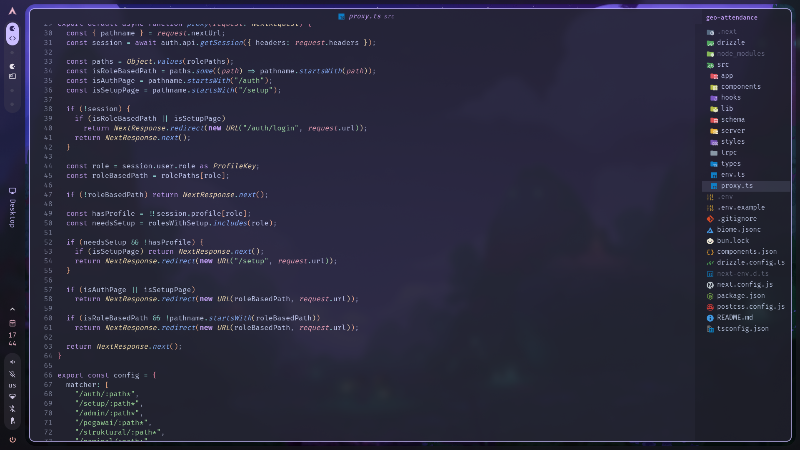
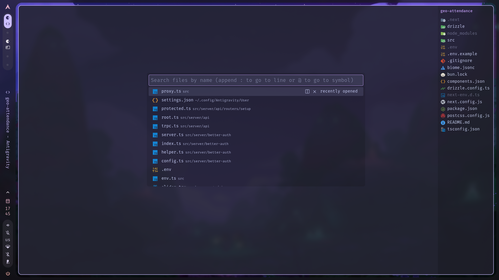

# vsadot

Personal VS Code settings for a minimal, distraction-free editing environment.

## Preview







## Overview

This repository contains a curated `settings.json` that strips VS Code down to its essentials, removing visual clutter and UI chrome to keep focus on the code.

## Credits

A large portion of this configuration is based on Igor Babko's VS Code setup, presented in [this video](https://www.youtube.com/watch?v=VmFOsK7IhI4). The original settings file is available on [GitHub](https://github.com/igorbabko/vscode-setup/blob/2025/.vscode/settings.json). This repo takes that foundation and tweaks it to fit a different workflow and toolchain.

## Differences from Original

The table below summarizes what was changed, added, or removed compared to the original config.

### Changed

| Setting | Original | This repo |
|---|---|---|
| `workbench.colorTheme` | Aura Dracula Spirit (Soft) | Catppuccin Mocha |
| `editor.fontFamily` | Dank Mono | FiraCode Nerd Font Mono |
| `terminal.integrated.fontFamily` | (not set) | FiraCode Nerd Font Mono |
| `custom-ui-style.font.sansSerif` | Dank Mono | FiraCode Nerd Font Mono |

### Removed

These settings from the original are not included here:

- `window.zoomLevel` -- zoom is left at default
- `editor.fontSize` / `editor.lineHeight` -- defaults are fine for FiraCode
- `editor.hover.enabled` -- hover is kept on
- `editor.tokenColorCustomizations` -- no italic comments
- `files.trimTrailingWhitespace` / `files.insertFinalNewline` -- handled by formatter
- `files.autoSave` -- manual save preferred
- `scm.diffDecorations` -- left at default
- `emmet.triggerExpansionOnTab` -- not needed
- `update.mode` / `extensions.ignoreRecommendations` -- left at default
- Aura theme-specific color overrides -- not applicable to Catppuccin
- Cursor gradient CSS (`.monaco-editor .cursors-layer .cursor`) -- using default block cursor

### Added

These settings are new and not present in the original:

- `workbench.auxiliaryActivityBar.location: hidden` -- hides the secondary activity bar
- `workbench.editor.titleScrollbarVisibility: visible` -- keeps tab scrollbar visible in single-tab mode
- `window.menuStyle: native` / `window.menuBarVisibility: hidden` / `window.controlsStyle: hidden` -- additional window chrome cleanup for Linux
- Terminal configuration -- zsh login shell with FiraCode Nerd Font Mono and ligatures
- `git.autorefresh: true` -- keeps git status in sync
- Custom UI rules for hiding the titlebar (`titlebar-right`, `.titlebar`) and the Antigravity welcome container
- `intelliphp.inlineSuggestionsEnabled: false` / `biome.suggestInstallingGlobally: false` -- suppresses extension prompts

## What It Does

### Minimal UI

- Hides the activity bar, status bar, menu bar, title bar, and breadcrumbs
- Disables tabs (single editor mode)
- Removes scrollbars, minimap, and overview ruler decorations
- Hides explorer arrows and decoration badges

### Editor

- Block cursor with solid (no blink) style
- Relative line numbers
- 2-space indentation
- No sticky scroll, code lens, lightbulb hints, or bracket matching highlights
- Tab completion enabled, inline suggestions disabled
- Multi-cursor via Ctrl/Cmd click

### Theme and Font

- **Theme:** Catppuccin Mocha
- **Font:** FiraCode Nerd Font Mono (with ligatures)
- **Icons:** Material Icon Theme

### Terminal

- Default shell: zsh (login shell)
- Font: FiraCode Nerd Font Mono with ligatures

### Custom UI Styling

Uses the **Custom UI Style** extension to apply additional CSS overrides:

- Removes box shadows from notifications and the quick input widget
- Centers the command palette vertically (25% from top)
- Hides the title bar, title actions, and scrollbar decorations
- Cleans up sidebar borders and focus outlines

### Other

- Git decorations disabled, auto-refresh enabled
- Biome global install suggestion suppressed
- IntelliPHP inline suggestions disabled

## Installation

1. Clone this repository:

   ```
   git clone <repo-url> ~/Projects/vsadot
   ```

2. Symlink the settings file to your VS Code config directory:

   ```
   ln -sf ~/Projects/vsadot/settings.json ~/.config/{Antigravity,Code}/User/settings.json
   ```

   Adjust the path if you use a different VS Code variant (e.g., `Code - Insiders`, `Code - OSS`, or `Codium`).

## Required Extensions

- [Catppuccin for VS Code](https://marketplace.visualstudio.com/items?itemName=Catppuccin.catppuccin-vsc) -- color theme
- [Material Icon Theme](https://marketplace.visualstudio.com/items?itemName=PKief.material-icon-theme) -- file icons
- [Custom UI Style](https://open-vsx.org/vscode/item?itemName=subframe7536.custom-ui-style) -- CSS overrides

## Required Fonts

- [FiraCode Nerd Font](https://www.nerdfonts.com/font-downloads) -- install the Mono variant

## License

Use however you like. No restrictions.
